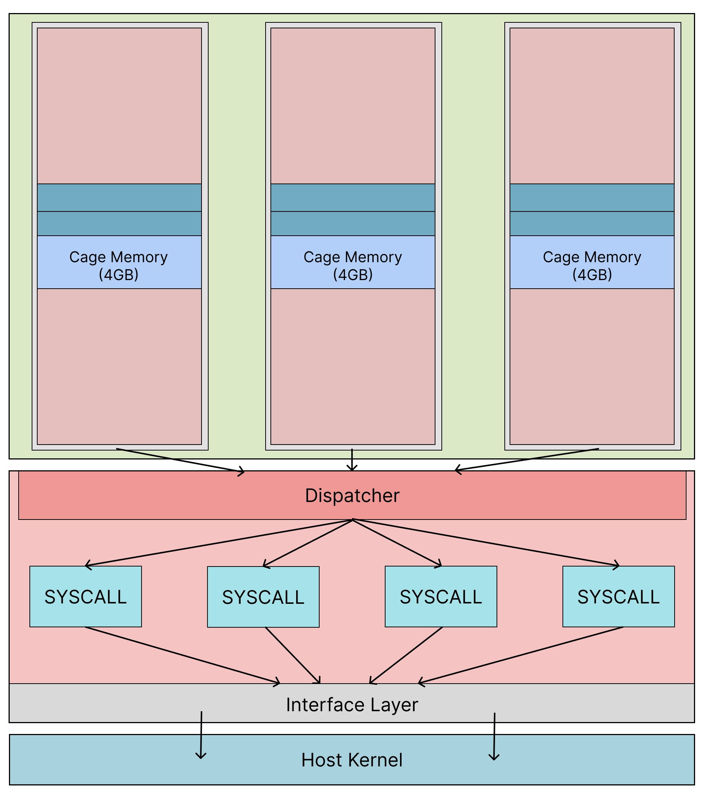

# RustPOSIX [](https://github.com/Lind-Project/RustPOSIX-rust/actions/workflows/lind-selfhost.yml)

# Table of Contents

- [RustPOSIX ](#rustposix-)
- [Table of Contents](#table-of-contents)
  - [Development Guideline](#development-guideline)
  - [Run RustPOSIX-Rust](#run-rustposix-rust)
  - [Test RustPOSIX-Rust](#test-rustposix-rust)

RustPOSIX refers to a library operating system (libOS) built using the Rust programming language as part of the Lind project.
It is a component of the Lind sandbox that provides a subset of the POSIX API (for things like networking, file I/O, etc.) to applications running within the Google Native Client (NaCl) sandbox. leveraging Rust's memory safety and concurrency safety guarantees to provide a secure implementation of OS functionality.

More implementation details could be found at [wiki](https://github.com/Lind-Project/lind-docs/blob/main/docs/RustPOSIX/Home.md).



## Development Guideline

- All PRs should be merged to the Develop branch

- Any imports from the standard library or any crates should be done in an interface file

More detailed guideline will be in [RustPOSIX's wiki](https://github.com/Lind-Project/lind-docs/blob/main/docs/RustPOSIX/Style-Guide.md)

## Run RustPOSIX-Rust

Quick start
Use Develop branch for the most stable behaviour.

```
docker build -t --platform <your platform> <image_name> .devcontainer
docker run -it <image_name>

```

This will create a quick container with rustposix build at your local changes.
helpful for exploration and easy testing.

See reference at [Run RustPOSIX Independently](https://github.com/Lind-Project/lind-docs/blob/main/docs/RustPOSIX/Run-Independently.md)

## Test RustPOSIX-Rust

Use Develop branch for the most stable behaviour.

```
cargo build
cargo test --lib
```

See reference at [Testing and Debugging](https://github.com/Lind-Project/lind-docs/blob/main/docs/RustPOSIX/Testing-and-Debugging.md)